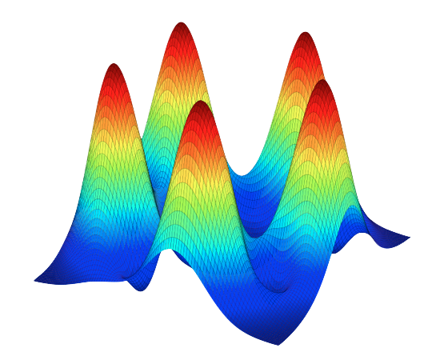

QuTiP: Quantum Toolbox in Python
================================

This documentation contains a user guide and automatically generated API documentation for QuTiP.
For more information see the `QuTiP project web page <https://qutip.org/>`_.
Here, you can also find a collection of `tutorials for QuTiP <https://qutip.org/qutip-tutorials/>`_.

.. toctree::
   :maxdepth: 3

   frontmatter.rst
   installation.rst
   guide/guide.rst
   apidoc/apidoc.rst

   changelog.rst
   contributors.rst
   development/development.rst
   biblio.rst
   copyright.rst

Indices and tables
====================

* :ref:`genindex`
* :ref:`modindex`
* :ref:`search`
