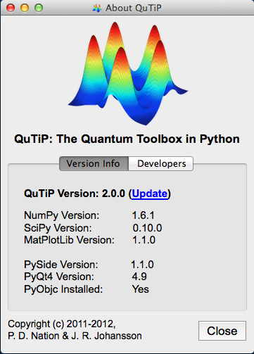

.. QuTiP 
   Copyright (C) 2011-2012, Paul D. Nation & Robert J. Johansson

.. _install:

**************
Installation
**************

.. important::
	
	QuTiP is designed for use on Unix based platforms such as Linux and Mac OSX *only*, and is known
	to break when running under the Microsoft Windows operating system.  As such, we do not provide
	any support for these platforms.  If they ever figure out that matrices do not have
	floating-point dimensions, then we might reconsider.

.. _install-requires:

General Installation Requirements
=================================

QuTiP requires the following packages to run:

.. tabularcolumns:: | p{3cm} | p{2.5cm} | L |

+------------+--------------+-----------------------------------------------------+
| Package    | Version      | Details                                             |
+============+==============+=====================================================+
| Python     | 2.6+ (not 3) | Requires multiprocessing (v2.6 and higher only).    |
|            |              | At present, Matplotlib does not work for Python 3.  |
+------------+--------------+-----------------------------------------------------+
| Numpy      | 1.6+         | Not tested on lower versions.                       |
+------------+--------------+-----------------------------------------------------+
| Scipy      | 0.9+         | Not tested on lower versions. Use 0.9+ if possible. |
+------------+--------------+-----------------------------------------------------+
| Matplotlib | 1.1.0+       | Some plotting does not work on lower versions.      |
+------------+--------------+-----------------------------------------------------+
| Qt         | 4.7.3+       | Optional.  For GUI elements only.                   |
+------------+--------------+-----------------------------------------------------+
| PySide     | 1.0.6+       | Optional, required only for GUI elements.           |
|            |              | PyQt4 may be used instead.                          |
+------------+--------------+-----------------------------------------------------+
| PyQt4      | 4.8+         | Optional, required only for GUI elements.           |
|            |              | PySide may be used instead (recommended).           |
+------------+--------------+-----------------------------------------------------+                      
| PyObjC     | 2.2+         | Mac only.  Very optional.  Needed only for a        |
|            |              | GUI Monte-Carlo progress bar.                       |
+------------+--------------+-----------------------------------------------------+
| Cython     | 0.15+        | Optional.  Needed for compiling some time-dependent |
|            |              | Hamiltonians.                                       |
+------------+--------------+-----------------------------------------------------+
| GCC        | 4.2+         | Needed for compiling Cython files.                  |
| Compiler   |              |                                                     |
+------------+--------------+-----------------------------------------------------+
| Python     | 2.6+         | Linux only.  Needed for compiling Cython files.     |
| Headers    |              |                                                     |
+------------+--------------+-----------------------------------------------------+
| LaTeX      | TexLive 2009+| Optional.  Needed if using LaTex in figure labels.  |    
+------------+--------------+-----------------------------------------------------+

On all platforms (Linux, Mac), QuTiP works "out-of-the-box" using the `Enthought Python Distribution <http://www.enthought.com/products/epd.php>`_ version 7.1 or higher.  This distribution is created by the developers of Numpy and Scipy, and is free for academic use.

.. _install-linux:

Installation on Ubuntu Linux
=================================

>>> sudo apt-get install python-scipy
>>> sudo apt-get install python-pyside or sudo apt-get install python-qt4
>>> sudo apt-get install python-setuptools
>>> sudo apt-get install python-dev

Ubuntu 11.04 and Lower (skip this step in Ubuntu 11.10+):
---------------------------------------------------------

These releases do not have Matplotlib>=1.0, and we therefore need to add the unofficial repository:

>>> sudo add-apt-repository ppa:bgamari/matplotlib-unofficial
>>> sudo apt-get update

Install Matplotlib:
-------------------

Regardless of Ubuntu version, we are now in a position to install the plotting library:

>>> sudo apt-get install python-matplotlib

QuTiP installation:
-------------------

>>> sudo python setup.py install

.. note:: 

    On some versions of Ubuntu you might have to configure Matplotlib to use the GTKAgg or Qt4Agg backends instead of the default TkAgg backend. To do this, edit /etc/matplotlibrc, and change ``backend: TkAgg`` to ``backend: GTKAgg`` or ``backend: Qt4Agg``.

.. _install-mac:

Installation on Mac OS X (10.6+)
=================================

If you have not done so already, install the Apple XCode developer tools from the Apple App Store.

Setup Using Macports: [*]_
--------------------------

On the Mac, it is recommended that you install the required libraries via `MacPorts <http://www.macports.org/ MacPorts>`_.  After installation, the necessary "ports" for QuTiP may be installed via:  

>>> sudo port install py27-scipy
>>> sudo port install py27-matplotlib +latex

additional, but optional, ports include:

>>> sudo port install py27-ipython
>>> sudo port install py27-cython
>>> sudo port install texlive-latex-extra

the last of which installs supplimentary LaTex fonts, and in addition:

>>> sudo port install py27-pyside

or:

>>> sudo port install py27-pyqt4

.. note:: The next step is optional, but is recommended if you plan to use the string (Cython) based time-dependent format.  See :ref:`time`.

Finally, we want to set the macports compiler to the vanilla GCC version.  From the command line type:

>>> port select gcc

which will bring up a list of installed compilers, such as::

	Available versions for gcc:
		apple-gcc42
		gcc42
		llvm-gcc42
		mp-gcc45
		none (active)

We want to set the the compiler to the gcc4x compiler, where x is the highest number avaliable, in this case ``mp-gcc45`` (the "mp-" does not matter).  To do this type:

>>> sudo port select gcc mp-gcc45

Running port select again should give::

	 Available versions for gcc:
	 	apple-gcc42
	 	gcc42
	 	llvm-gcc42
	 	mp-gcc45 (active)
	 	none

Setup via SciPy Superpack:
--------------------------

A second option is to install the required Python packages using the `SciPy Superpack <http://fonnesbeck.github.com/ScipySuperpack/>`_.  Further information on installing the superpack can be found on the `SciPy Downloads page <http://www.scipy.org/Download>`_.  Note that, if you choose this option, the GUI elements of QuTiP will not be available without futher installing either the PyQt4 or PySide packages separately.

Enthought Python Distribution:
------------------------------

Finally, one can also use the `Enthought Python Distribution <http://www.enthought.com/products/epd.php>`_ version 7.1 or higher to satisfy the QuTiP dependencies.  

Installing QuTiP:
-----------------

No matter which installation path you choose, installing QuTiP is the same as on linux.  From the QuTiP directory:

>>> sudo python setup.py install

.. _install-verify:

Verifying the Installation
============================

QuTiP now includes a collection of builtin test scripts to verify that the installation was indeed successful.  To run the suite of tests scripts, after installing QuTiP call:

>>> python setup.py test

If sucessful, these tests indicate that all of the QuTiP functions are working properly.  If any errors occur, please check that your have installed all of the required modules.  See the next section on how to check the installed versions of the QuTiP dependencies.  If these tests still fail, then head on over to the `QuTiP Discussion Board <http://groups.google.com/group/qutip>`_ and post a message detailing your particular issue.

To further verify that all of the QuTiP components are working, you can run the collection of examples built into QuTiP as discussed in the :ref:`examples` section of the guide. 

.. _install-aboutbox:

Checking Version Information via the About Box
===============================================

QuTiP includes a graphical "about" box for viewing information about QuTiP, and the important dependencies installed on your system.  To view the about box type:

>>> about()

that will pop-up a window similar to the one shown below.  If instead you get command-line output, then your PyQt or PySide graphics are not installed properly or unavailable.  When running the about box, QuTiP will automatically check for a newer version of itself from the QuTiP website.  As shown below, the about box will have an "update" link next to the QuTiP version number if your are not running the latest version of QuTiP

   
   QuTiP about box window with link to updated version on the QuTiP website.

.. [*] Installing QuTiP via Macports will take a long time as each of the QuTiP dependencies is build from source code.  The advantage is that, after installation, everything is more or less guarenteed to work.  However, if you have a hot date waiting for you, then we do not recommend this path.  Or course, if you are reading this guide, this may not be the case. 
