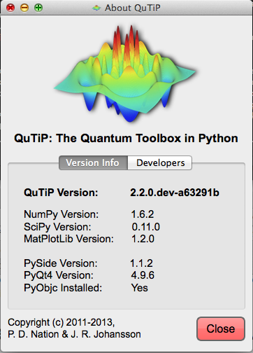

.. QuTiP 
   Copyright (C) 2011-2012, Paul D. Nation & Robert J. Johansson

.. _install:

**************
Installation
**************

.. _install-requires:

General Requirements
=====================

QuTiP is based on several open-source packages designed for numerical simulations in the Python
programming language.  Currently. QuTiP requires the following packages to run:

.. tabularcolumns:: | p{3cm} | p{2.5cm} | L |

+----------------+--------------+-----------------------------------------------------+
| Package        | Version      | Details                                             |
+================+==============+=====================================================+
| **Python**     | 2.6+         | Requires multiprocessing (v2.6 and higher only).    |
+----------------+--------------+-----------------------------------------------------+
| **Numpy**      | 1.6+         | Not tested on lower versions.                       |
+----------------+--------------+-----------------------------------------------------+
| **Scipy**      | 0.9+         | Not tested on lower versions. Use 0.9+ if possible. |
+----------------+--------------+-----------------------------------------------------+
| **Matplotlib** | 1.1.0+       | Some plotting does not work on lower versions.      |
+----------------+--------------+-----------------------------------------------------+
| **GCC**        | 4.2+         | Needed for compiling Cython files.                  |
| **Compiler**   |              |                                                     |
+----------------+--------------+-----------------------------------------------------+
| Qt             | 4.7.3+       | Optional.  For GUI elements only.                   |
+----------------+--------------+-----------------------------------------------------+
| PySide         | 1.0.6+       | Optional, required only for GUI elements.           |
|                |              | PyQt4 may be used instead.                          |
+----------------+--------------+-----------------------------------------------------+
| PyQt4          | 4.8+         | Optional, required only for GUI elements.           |
|                |              | PySide may be used instead (recommended).           |
+----------------+--------------+-----------------------------------------------------+                      
| PyObjC         | 2.2+         | Mac only.  Very optional.  Needed only for a        |
|                |              | GUI Monte Carlo progress bar.                       |
+----------------+--------------+-----------------------------------------------------+
| Cython         | 0.15+        | Optional.  Needed for compiling some time-dependent |
|                |              | Hamiltonians.                                       |
+----------------+--------------+-----------------------------------------------------+
| BLAS           | 1.2+         | Optional, Linux & Mac only.                         |
| library        |              | Needed for installing Fortran Monte Carlo solver.   |
+----------------+--------------+-----------------------------------------------------+
| Mayavi         | 4.1+         | Optional.  Needed for using the Bloch3d class.      |
+----------------+--------------+-----------------------------------------------------+
| Python         | 2.6+         | Linux only.  Needed for compiling Cython files.     |
| Headers        |              |                                                     |
+----------------+--------------+-----------------------------------------------------+
| LaTeX          | TexLive 2009+| Optional.  Needed if using LaTeX in figures.        |    
+----------------+--------------+-----------------------------------------------------+
| nose           | 1.1.2+       | Optional. For running tests.                        |
+----------------+--------------+-----------------------------------------------------+

|
On all platforms (Linux, Mac, Windows), QuTiP works "out-of-the-box" using the `Anaconda CE <https://store.continuum.io/cshop/anaconda>`_.  This distribution is created by the developers of Numpy, and is free for both commercial and noncommercial use.

As of version 2.2, QuTiP includes an optional Fortran-based Monte Carlo solver that has a substantial performance benefit when compared with the Python-based solver. In order to install this package you must have a Fortran compiler (for example gfortran) and BLAS development libraries.  At present, these packages are only tested on the Linux and OS X platforms.

.. _install-get-it:

Get the software
================

Official releases of QuTiP are available from the download section on the project's web pages

    http://code.google.com/p/qutip/downloads

and the latest source code is available in our Github repository

    http://github.com/qutip

In general we recommend users to use the latest stable release of QuTiP, but if you are interested in helping us out with development or wish to submit bug fixes, then use the latest development version from the Github repository.

.. _install-linux:

Installation on Ubuntu Linux
============================

Using QuTiP's PPA
-------------------

The easiest way to install QuTiP in Ubuntu (12.04 and later) is to use the QuTiP PPA::

    sudo add-apt-repository ppa:jrjohansson/qutip-releases
    sudo apt-get update
    sudo apt-get install python-qutip

With this method the most important dependencies are installed automatically, and when a new version of QuTiP is released it can be upgraded through the standard package management system. In addition to the required dependencies, it is also strongly recommended that you install the ``texlive-latex-extra`` package::

    sudo apt-get install texlive-latex-extra

Manual installation
-------------------

First install the following dependency packages::

    sudo apt-get install python-scipy
    sudo apt-get install python-pyside
    sudo apt-get install python-setuptools
    sudo apt-get install python-dev
    sudo apt-get install python-matplotlib
    sudo apt-get install cython
    sudo apt-get install python-nose         # recommended, for testing
    sudo apt-get install texlive-latex-extra # recommended
    sudo apt-get install libblas-dev         # optional, for Fortran Monte Carlo solver
    sudo apt-get install mayavi2             # optional, for Bloch3d only

For a standard installation, run this command in the QuTiP source code directory::

    sudo python setup.py install

To install QuTiP with the optional Fortran Monte Carlo solver use::

    sudo python setup.py install --with-f90mc

However, this additionally requires a Fortran compiler to be installed. For
example the GNU Fortran compiler, which can be installed using::

    sudo apt-get install gfortran

.. note::

    Ubuntu 11.04 and lower do not have Matplotlib>=1.0, but we can use the following
    unofficial matplotlib ppa to install a newer version of matplotlib on these
    Ubuntu releases::

        sudo add-apt-repository ppa:bgamari/matplotlib-unofficial
        sudo apt-get update
        sudo apt-get install python-matplotlib

.. note:: 

    On some versions of Ubuntu you might have to configure Matplotlib to use the GTKAgg or Qt4Agg backends instead of the default TkAgg backend. To do change backend, edit /etc/matplotlibrc or ~/.matplotlib/matplotlibrc, and change ``backend: TkAgg`` to ``backend: GTKAgg`` or ``backend: Qt4Agg``.

.. _install-mac:

Installation on Mac OS X (10.6+)
=================================

If you have not done so already, install the Apple Xcode developer tools from the Apple App Store.  After installation, open Xcode and go to: Preferences -> Downloads, and install the 'Command Line Tools'.

Setup Using Macports [*]_
--------------------------

On the Mac, it is recommended that you install the required libraries via `MacPorts <http://www.macports.org/ MacPorts>`_.  After installation, the necessary "ports" for QuTiP may be installed via::

    sudo port install py27-scipy
    sudo port install py27-matplotlib +latex

and in addition::

    sudo port install py27-pyside   # recommended

or::

    sudo port install py27-pyqt4

Optional, but highly recommended ports include::

    sudo port install py27-ipython +pyside+notebook+parallel+scientific  #switch to +pyqt4 if using pyqt4
    sudo port install py27-cython             #used for string-based time-dependent Hamiltonians
    sudo port install vtk5 +python27+qt4_mac  #used for the Bloch3d class
    sudo port install py27-mayavi             #used for the Bloch3d class

Now, we want to tell OSX which Python and iPython we are going to use::
    
    sudo port select python python27
    sudo port select ipython ipython27

.. note:: The next step is optional, but is necessary if you plan to use the string (Cython) based time-dependent format.  See :ref:`time`.

Finally, we want to set the macports compiler to the vanilla GCC version.  From the command line type::

    port select gcc

which will bring up a list of installed compilers, such as::

	Available versions for gcc:
		apple-gcc42
		gcc42
		llvm-gcc42
		mp-gcc47
		none (active)

We want to set the the compiler to the gcc4x compiler, where x is the highest number available, in this case ``mp-gcc47`` (the "mp-" does not matter).  To do this type::

    sudo port select gcc mp-gcc47

Running port select again should give::

	 Available versions for gcc:
	 	apple-gcc42
	 	gcc42
	 	llvm-gcc42
	 	mp-gcc47 (active)
	 	none

Setup via SciPy Superpack
-------------------------

A second option is to install the required Python packages using the `SciPy Superpack <http://fonnesbeck.github.com/ScipySuperpack/>`_.  Further information on installing the superpack can be found on the `SciPy Downloads page <http://www.scipy.org/Download>`_.  Note that, if you choose this option, the GUI elements of QuTiP will not be available without further installing either the PyQt4 or PySide packages separately.

Anaconda CE Distribution
------------------------

Finally, one can also use the `Anaconda CE <https://store.continuum.io/cshop/anaconda>`_ package to install all of the QuTiP dependencies. 

Installing QuTiP
----------------

No matter which installation path you choose, installing a standard QuTiP installation is the same as on linux.  From the QuTiP directory run::

    sudo python setup.py install

In order to install the Fortran Monte Carlo solver use the following command::

    sudo python setup.py install --with-f90mc

.. _install-win:

Installation on Windows
========================

QuTiP is primarily developed for Unix-based platforms such as Linux an Mac OS X, but it can also be used on Windows. We have limited experience and ability to help troubleshoot problems on Windows, but the following installation steps have been reported to work:

1. Install the `Python(X,Y) <http://code.google.com/p/pythonxy/>`_ distribution (tested with version 2.7.3.1). Other Python distributions, such as `Enthought Python Distribution <http://www.enthought.com/products/epd.php>`_ or `Anaconda CE <http://continuum.io/downloads.html>`_ might work too, but this has not been verified.

2. When installing Python(x,y), explicitly select to include the Cython package in the installation. This package is not selected by default.

3. Add the following content to the file `C:/Python27/Lib/distutils/distutils.cfg` (or create the file if it does not already exists)::

    [build]
    compiler = mingw32

    [build_ext]
    compiler = mingw32

The directory where the distutils.cfg file should be placed might be different if you have installed the Python environment in a different location than in the example above.

4. Obtain the QuTiP source code, unpack it and run the following command in the source code directory::

    python setup.py install

.. _install-verify:

Verifying the Installation
===========================

QuTiP now includes a collection of built-in test scripts to verify that the installation was indeed successful.  To run the suite of tests scripts you must have the nose testing library.  After installing QuTiP, exit the installation directory, run Python (or iPython), and call:

>>> import qutip.testing as qt
>>> qt.run()

If successful, these tests indicate that all of the QuTiP functions are working properly.  If any errors occur, please check that your have installed all of the required modules.  See the next section on how to check the installed versions of the QuTiP dependencies.  If these tests still fail, then head on over to the `QuTiP Discussion Board <http://groups.google.com/group/qutip>`_ and post a message detailing your particular issue.

To further verify that all of the QuTiP components are working, you can run the collection of examples built into QuTiP as discussed in the :ref:`examples` section of the guide. 

.. _install-aboutbox:

Checking Version Information via the About Box
===============================================

QuTiP includes a graphical "about" box for viewing information about QuTiP, and the important dependencies installed on your system.  To view the about box type:

>>> from qutip import *
>>> about()

That will pop up a window similar to the one shown below.  If instead you get command-line output, then your PyQt or PySide graphics are not installed properly or unavailable.  When running the about box, QuTiP will automatically check for a newer version of itself from the QuTiP website. The about box will have an "update" link next to the QuTiP version number if your are not running the latest version of QuTiP.

   
   QuTiP about box window.

.. [*] Installing QuTiP via Macports will take a long time as each of the QuTiP dependencies is build from source code.  The advantage is that, after installation, everything is more or less guaranteed to work.  However, if you have a hot date waiting for you, then we do not recommend this path.  Or course, if you are reading this guide, this may not be the case. 
