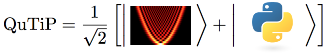

.. QuTiP 
   Copyright (C) 2011-2012, Paul D. Nation & Robert J. Johansson

About QuTiP
*************

Every quantum system encountered in the real world is an open quantum system. For although much care is taken experimentally to eliminate the unwanted influence of external interactions, there remains, if ever so slight, a coupling between the system of interest and the external world. In addition, any measurement performed on the system necessarily involves coupling to the measuring device, therefore introducing an additional source of external influence. Consequently, developing the necessary tools, both theoretical and numerical, to account for the interactions between a system and its environment is an essential step in understanding the dynamics of quantum systems.

In general, for all but the most basic of Hamiltonians, an analytical description of the system dynamics is not possible, and one must resort to numerical simulations of the equations of motion. In absence of a quantum computer, these simulations must be carried out using classical computing techniques, where the exponentially increasing dimensionality of the underlying Hilbert space severely limits the size of system that can be efficiently simulated. However, in many fields such as quantum optics, trapped ions, superconducting circuit devices, and most recently nanomechanical systems, it is possible to design systems using a small number of effective oscillator and spin components, excited by a small number of quanta, that are amenable to classical simulation in a truncated Hilbert space.

The Quantum Toolbox in Python, or QuTiP, is a fully open-source implementation of a framework written in the Python programming language designed for simulating the open quantum dynamics for systems such as those listed above. This framework distinguishes itself from the other available software solutions by providing the following advantages:

* QuTiP relies on completely open-source software.  You are free to modify and use it as you wish with no licensing fees.

* QuTiP is based on the Python scripting language, providing easy to read, fast code generation without the need to compile after modification.

* The numerics underlying QuTiP are time-tested algorithms that run at C-code speeds, thanks to the `Numpy <http://numpy.scipy.org/>`_ and `Scipy <http://www.scipy.org/ scipy>`_ libraries, and are based on many of the same algorithms used in propriety software.

* QuTiP allows for solving the dynamics of Hamiltonians with arbitrary time-dependence, including collapse operators.

* Time-dependent problems can be automatically compiled into C-code at run-time for increased performance.

* Takes advantage of the multiple processing cores found in essentially all modern computers.

* QuTiP was designed from the start to require a minimal learning curve for those users who have experience using the popular quantum optics toolbox by Sze M. Tan. 

* Includes the ability to create high-quality plots, and animations, using the excellent `Matplotlib <http://matplotlib.sourceforge.net/>`_ package.

Organization
=============

QuTiP is designed to be a general toolbox for solving quantum optics like problems.  As such, the QuTiP framework is built from a large (and ever growing) library of functions; from :func:`qutip.states.basis` to :func:`qutip.wigner`.  The general organization of QuTiP, highlighting the important functions avalaible to the user is shown below.

.. figure:: figures/qutip_org.png
   :align: center
   
   QuTiP tree-diagram of user accessible functions and classes.

Whats New in QuTiP Version 2.0
================================

The second version of QuTiP has seen many improvements in the performance of the original code base, as well as the addition of several new routines supporting a wide range of functionality.  Some of the highlights of this release include:
